# 🏢 QUY TRÌNH VẬN HÀNH - LUNA ENGLISH CƠ SỞ TÂN MAI

> **Tài liệu nội bộ** | Cập nhật: Tháng 02/2026
> Cơ sở: Số 278C1 Tân Mai, Q. Hoàng Mai, Hà Nội | 9 lớp | ~95 học sinh

---

## 📊 TỔNG QUAN CƠ SỞ

| Hạng mục | Thông tin |
|----------|-----------|
| **Chương trình** | Buttercup (6 lớp, ~60 HS) + Primary Success (3 lớp, ~35 HS) |
| **Độ tuổi** | 4-12 tuổi |
| **Giáo viên** | Rosie Mai, ClaraNga, TrangTrouu, JeanDiep, Quỳnh Trang + GV nước ngoài |
| **Phòng học** | 3A, 3B, 4A, 4B |
| **Khung giờ** | 17:30-19:00 & 19:00-20:30, T2-CN |

---

## 🏗️ SƠ ĐỒ TỔ CHỨC

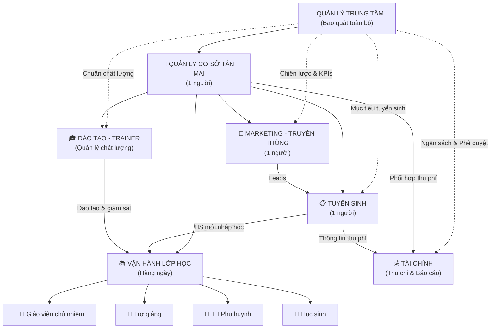

---

## 🔄 WORKFLOW TỔNG THỂ - LUỒNG VẬN HÀNH LIÊN KẾT

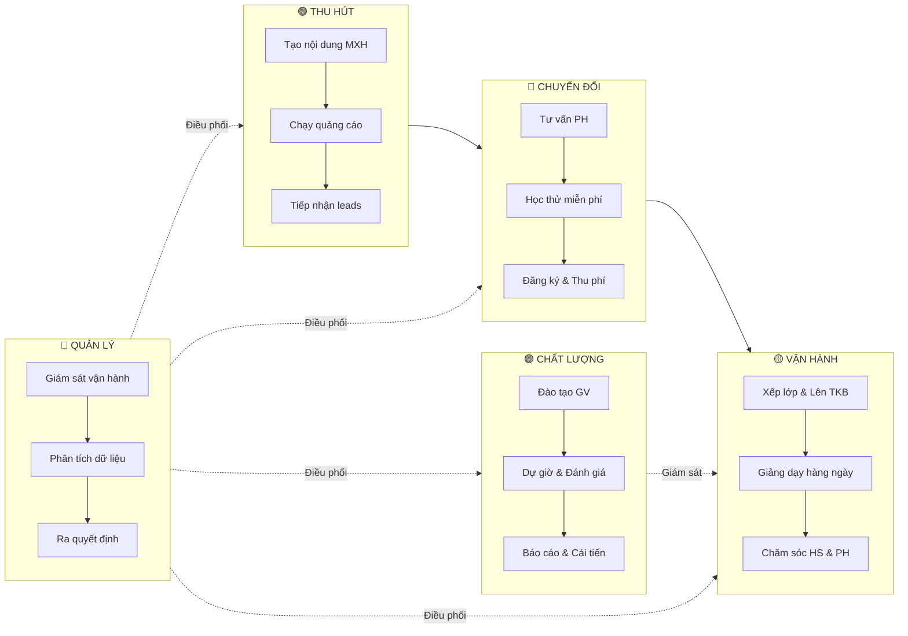

---

## 📋 CHI TIẾT TỪNG PHÒNG BAN / VỊ TRÍ

---

### 1. 📣 MARKETING - TRUYỀN THÔNG (1 người)

#### Mục tiêu công việc
- Xây dựng nhận diện thương hiệu Luna English tại khu vực Tân Mai - Hoàng Mai
- Tạo **leads đủ chất lượng** cho bộ phận Tuyển sinh (mục tiêu: 30-50 leads/tháng)
- Duy trì tương tác fanpage & cộng đồng phụ huynh

#### Mô tả công việc

| Hạng mục | Chi tiết |
|----------|----------|
| **Quản lý fanpage** | Đăng bài 4-5 bài/tuần theo content calendar, phản hồi inbox/comment |
| **Sản xuất nội dung** | Video lớp học, ảnh hoạt động, testimonial phụ huynh, infographic chương trình |
| **Quảng cáo** | Chạy ads Facebook/Zalo OA hướng đến PH khu vực Hoàng Mai, Thanh Xuân |
| **Offline marketing** | Phát tờ rơi tại trường TH Tân Mai (đối diện), banner, standee tại cơ sở |
| **Báo cáo** | Thống kê reach/leads/chi phí hàng tuần cho Quản lý cơ sở |

#### Quy trình thực hiện

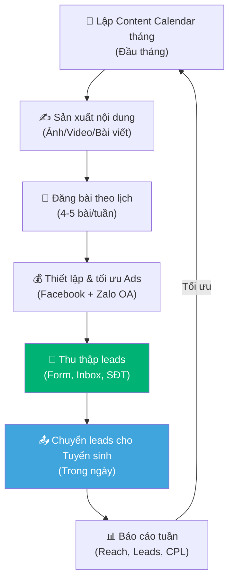

> [!IMPORTANT]
> **Kết nối liên phòng ban:** Marketing chuyển leads cho Tuyển sinh **trong vòng tối đa 4h**. Tuyển sinh phản hồi kết quả chuyển đổi để Marketing tối ưu nguồn ads.

---

### 2. 📋 TUYỂN SINH (1 người)

#### Mục tiêu công việc
- Chuyển đổi leads thành học sinh đăng ký (tỷ lệ mục tiêu: ≥30%)
- Duy trì tỷ lệ tái đăng ký (retention) ≥85% mỗi level
- Quản lý danh sách học viên tiềm năng, theo dõi pipeline

#### Mô tả công việc

| Hạng mục | Chi tiết |
|----------|----------|
| **Tiếp nhận leads** | Từ Marketing (online) & walk-in (PH đến trực tiếp) |
| **Tư vấn** | Giới thiệu chương trình, biểu phí, test đầu vào xếp lớp |
| **Tổ chức học thử** | Sắp xếp buổi trial class cho HS mới |
| **Thu phí & Đăng ký** | Hoàn tất thủ tục nhập học, thu phí, cấp tài liệu |
| **Chăm sóc tái đăng ký** | Liên hệ PH trước khi hết level để gia hạn |
| **Quản lý dữ liệu** | Cập nhật Google Sheets, phần mềm Easycheck danh sách HS |

#### Quy trình thực hiện

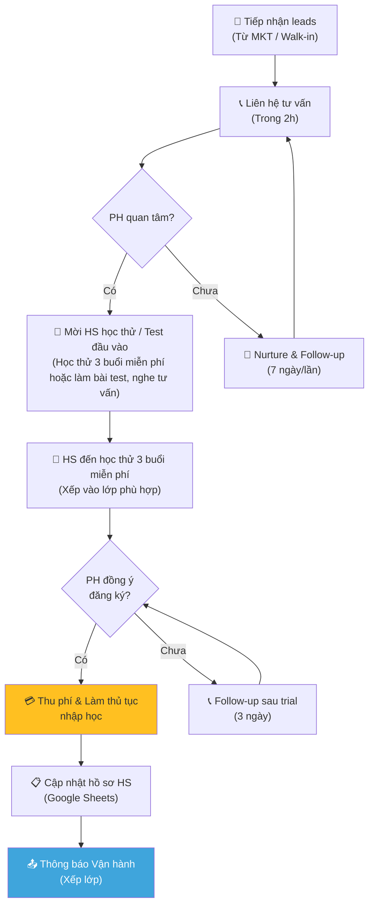

**Biểu phí tham khảo:**

| Chương trình | Đơn giá | Ưu đãi |
|-------------|---------|--------|
| Buttercup | 5.000.000đ/level (35 buổi) | 2 levels: 9.600.000đ · 4 levels: 18.400.000đ |
| Primary Success | 200.000đ/buổi (10 buổi) | 30 buổi: 185.000đ/buổi |
| Gom nhóm 3+ | -300.000đ/bạn | Gom 5+: -500.000đ/bạn |
| Anh chị em | -10% cho bạn thứ 2 | Suốt quá trình học |

##### Quy trình nghỉ học / Bảo lưu / Rút khỏi trung tâm

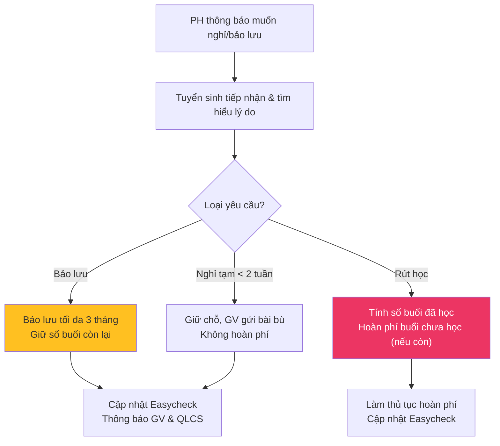

| Trường hợp | Chính sách | Người xử lý |
|------------|-----------|---------------|
| Nghỉ tạm ≤2 tuần | Giữ chỗ, không hoàn phí, GV gửi bài bù | GV + Tuyển sinh |
| Bảo lưu | Tối đa 3 tháng, giữ số buổi chưa học | Tuyển sinh + QLCS |
| Rút học | Hoàn phí buổi chưa học (trừ phí giáo trình) | QLCS + QLTTT |
| Chuyển lớp | Xếp lại lớp phù hợp, không mất phí | Tuyển sinh + GV |

##### Quy trình gia hạn / Chuyển level mới

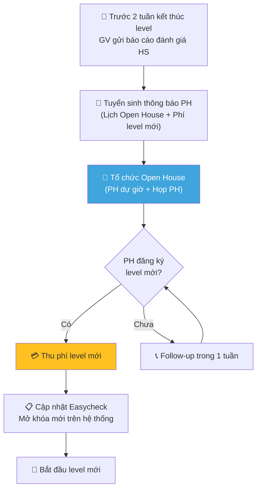

---

### 3. 🎓 ĐÀO TẠO - TRAINER (Quản lý chất lượng)

#### Mục tiêu công việc
- Đảm bảo **100% giáo viên** đạt chuẩn giảng dạy theo từng chương trình
- Giám sát chất lượng bài giảng qua dự giờ (≥2 lần/GV/tháng)
- Phát triển năng lực GV liên tục, đảm bảo học sinh đạt chuẩn đầu ra

#### Mô tả công việc

| Hạng mục | Chi tiết |
|----------|----------|
| **Đào tạo GV mới** | Training tập trung 2-4 tuần trước khi đứng lớp |
| **Đào tạo liên tục** | Workshop hàng tháng, chia sẻ best practices |
| **Dự giờ & Đánh giá** | Quan sát lớp học, đánh giá theo rubric chuẩn |
| **Phát triển giáo trình** | Chuẩn hóa lesson plans, tài liệu giảng dạy |
| **Quản lý GVNN** | Phối hợp với GV nước ngoài dạy Funtime |
| **Báo cáo chất lượng** | Gửi báo cáo đánh giá GV cho Quản lý trung tâm |

#### Quy trình thực hiện

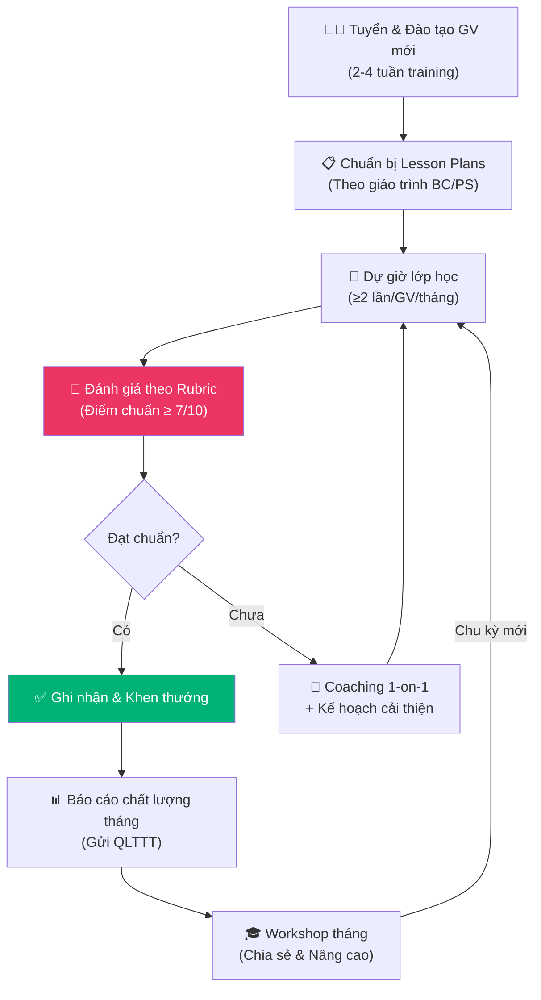

**Chuẩn đầu ra cần giám sát:**

| Chương trình | Đầu ra | Milestone |
|-------------|--------|-----------|
| Buttercup Year 1 (L1-3) | Pre-A1 | Nghe 50%, Nói 70%, Đọc 20% |
| Buttercup Year 2 (L4-6) | Pre-A1 | Nghe 70%, Nói 80%, Đọc 50%, Viết 40% |
| Buttercup Year 3 (L7-10) | Pre-A1 | Nghe 80%, Nói 80%, Đọc 80%, Viết 70% |
| Primary Success L1 | Movers (A1) | 4 kỹ năng theo CEFR |
| Primary Success L2 | Flyers (A2) | 4 kỹ năng theo CEFR |

---

### 4. 📚 VẬN HÀNH LỚP HỌC HÀNG NGÀY

#### 4A. 👩‍🏫 Giáo viên chủ nhiệm (5 GV: Rosie Mai, ClaraNga, TrangTrouu, JeanDiep, Quỳnh Trang)

**Mục tiêu:** Đảm bảo chất lượng giảng dạy theo lesson plan, học sinh tiến bộ đúng lộ trình.

| Hạng mục | Chi tiết |
|----------|----------|
| **Trước buổi học** | Soạn bài theo lesson plan, chuẩn bị tài liệu/đồ dùng |
| **Trong buổi học** | Giảng dạy 45 phút Interactive Time (Buttercup) hoặc 90 phút (PS) |
| **Sau buổi học** | Ghi nhận xét, chấm bài, gửi video tập học lên nhóm PH |
| **Định kỳ** | Giao bài về nhà qua app Buttercup Learning (BC) / TAK12 (tiểu học+), 5 buổi/lần. Cập nhật nhận xét HS lên lớp học + đồng bộ thông tin lên app Easycheck |
| **Cuối level** | Video phỏng vấn từng HS, tổ chức Open House, báo cáo đánh giá |

#### 4B. 👥 Trợ giảng (TA) / Giáo viên FUNTIME

**Mục tiêu:** Hỗ trợ GV chủ nhiệm trong giờ Interactive Time, **đứng lớp chính trong giờ Funtime** (35 phút), đảm bảo an toàn tuyệt đối và trải nghiệm lớp học tốt nhất cho HS.

##### Mô tả công việc chi tiết

| Giai đoạn | Công việc | Chi tiết |
|-----------|----------|----------|
| **Trước lớp (30 phút)** | Setup phòng học | Bật điều hoà, kiểm tra tivi/loa đài, chuẩn bị flashcards, giáo cụ, sticker/stamp |
| | Đón học sinh | Chào hỏi PH, nhận diện HS, sắp xếp HS vào lớp, điểm danh |
| | Soạn bài Funtime | Chuẩn bị game, warm-up, tài liệu cho phần Funtime sẽ dạy |
| **Trong lớp - Interactive Time (45 phút)** | Hỗ trợ GV chủ nhiệm | Quản lý trật tự lớp, nhắc nhở HS mất tập trung, hỗ trợ HS yếu |
| | Hỗ trợ GVNN | Phiên dịch khi cần, hỗ trợ giao tiếp GV nước ngoài - HS |
| | Quay video | Ghi hình hoạt động lớp để gửi lên nhóm PH |
| **Trong lớp - Funtime (35 phút)** | **Đứng lớp chính** | Tổ chức game từ vựng, cấu trúc câu, warm-up; duy trì năng lượng cao, 100% tiếng Anh |
| | Quản lý lớp | Khen thưởng (sticker, stamp), kỷ luật đúng lúc, chia đội, thu hút sự chú ý |
| **Sau lớp** | Trả HS an toàn | Thực hiện checklist an toàn: xác nhận đúng PH/người đón, không để HS tự ra về |
| | Hành chính | Vệ sinh phòng, cập nhật điểm danh, báo cáo sự cố (nếu có) |

##### Yêu cầu năng lực

| Tiêu chí | Yêu cầu |
|----------|----------|
| **Tiếng Anh** | Phát âm chuẩn, classroom language tốt, giao tiếp 100% TA trong lớp |
| **Năng lượng** | Tươi cười, giọng to rõ, enthusiastic, body language tích cực |
| **Quản lý lớp** | Bao quát lớp, khen thưởng/kỷ luật phân minh, thu hút sự chú ý |
| **An toàn** | Đảm bảo an toàn tuyệt đối cho trẻ (đón/trả, trong lớp) |
| **Giao tiếp PH** | Chuyên nghiệp, ân cần, nhớ mặt nhớ tên PH & HS (Nguyên tắc 3C) |
| **Nhớ HS** | Nhớ tên ≥50% HS tuần đầu, 100% HS + đặc điểm tính cách sau tháng đầu |

##### Lộ trình đào tạo trợ giảng mới (4 buổi)

| Buổi | Nội dung | Hình thức | Mục tiêu |
|------|----------|-----------|----------|
| **Buổi 1** | Dự giờ thực tế (Shadowing) | Quan sát | Hiểu flow lớp học, cách tương tác HS/PH |
| **Buổi 2** | Đào tạo lý thuyết (2-3h) | Training 1-1/Nhóm | Văn hoá, quy trình, kỹ năng quản lý lớp, xử lý tình huống |
| **Buổi 3** | Thực hành có hướng dẫn | On-job Training | Đứng lớp thực tế dưới giám sát Quản lý |
| **Buổi 4** | Demo & Đánh giá final | Kiểm tra năng lực | Dạy thử Funtime 15-20 phút + xử lý tình huống (Role-play) |

##### Tiêu chí đánh giá

**Demo cuối đào tạo (thang 10 điểm):**

| Tiêu chí | Trọng số | Nội dung |
|----------|----------|----------|
| Năng lượng & Thái độ | 3 điểm | Tươi cười, giọng to rõ, enthusiastic |
| Ngôn ngữ | 2 điểm | Tiếng Anh chuẩn, classroom language rõ ràng |
| Kỹ năng quản lý lớp | 3 điểm | Bao quát, thưởng phạt, thu hút |
| Quy trình & An toàn | 2 điểm | Nắm vững các bước, đảm bảo an toàn |

**Đánh giá sau tháng thử việc (thang 50 điểm):**

| Hạng mục | Trọng số | Tiêu chí |
|----------|----------|----------|
| Chuyên môn | 40% | Đứng lớp Funtime, quản lý lớp |
| Dịch vụ | 30% | Chăm sóc PH, an toàn trẻ |
| Thái độ | 30% | Kỷ luật, teamwork |

> Kết quả: **≥40đ** Xuất sắc → Ký HĐ chính thức | **30-39đ** Đạt → Ký HĐ kèm cam kết cải thiện | **<30đ** Không đạt

##### Quy trình bàn giao lớp học (khi thay đổi TA)

| Hạng mục bàn giao | Nội dung |
|--------------------|----------|
| Tài liệu & học cụ | Sách GV, flashcards, CD/file nghe, danh sách lớp, sticker/nam châm |
| Tình hình lớp | Nề nếp, thái độ chung, tiến độ bài học (đã cập nhật trên Easycheck) |
| HS cần lưu ý | Học lực yếu, HS cá biệt, vấn đề sức khoẻ/tâm lý |
| Lưu ý khác | Đặc điểm PH, thói quen GVNN, quy định riêng lớp |

#### 4C. 👨‍👩‍👧 Phụ huynh & 🧒 Học sinh

| Vai trò | Tương tác |
|---------|-----------|
| **Phụ huynh** | Nhận video lớp học, theo dõi bài tập trên app, tham gia Open House, phản hồi chất lượng, **đóng học phí đúng hạn** |
| **Học sinh** | Tham gia lớp học, **làm bài tập về nhà đầy đủ** qua app Buttercup Learning (BC) / TAK12 (tiểu học+), tham gia phỏng vấn cuối level |

#### Quy trình vận hành 1 buổi học (Buttercup)

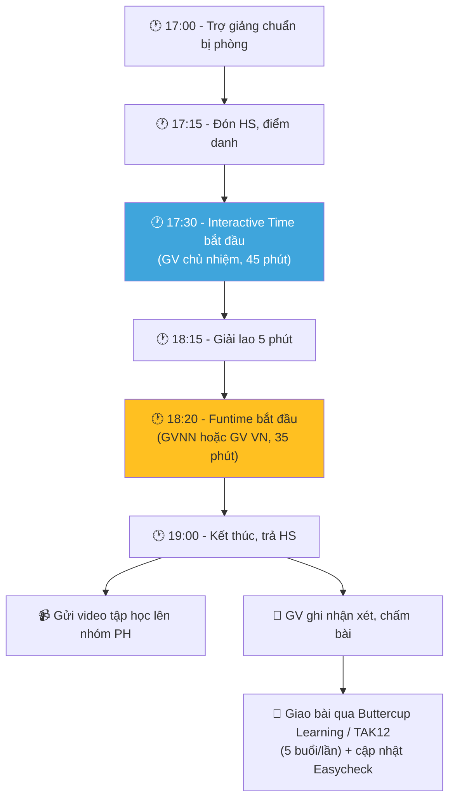

#### 4D. ⚠️ Quy trình dự phòng khi GV/TA nghỉ đột xuất

| Tình huống | Phương án | Người quyết định | Thời hạn xử lý |
|-----------|----------|--------------------|-----------------|
| **GV nghỉ có báo trước** | Sắp xếp GV dự bị thay thế, thông báo PH | QLCS | Trước 24h |
| **GV nghỉ đột xuất** | TA có kinh nghiệm đứng lớp tạm (Funtime style) hoặc dồn lớp với GV khác cùng khung giờ | QLCS | Ngay lập tức |
| **TA nghỉ đột xuất** | QLCS hoặc TA lớp khác hỗ trợ, báo GV tự quản lớp phần Funtime | QLCS | Ngay lập tức |
| **GVNN nghỉ** | TA đứng Funtime thay, chuyển buổi GVNN sang tuần sau | QLCS + Trainer | Trong ngày |

> [!WARNING]
> **Nguyên tắc:** Không được hủy buổi học trừ trường hợp bất khả kháng. Nếu phải hủy, thông báo PH trước **tối thiểu 2 tiếng** và bố trí buổi học bù trong tuần.

---

### 5. 🏢 QUẢN LÝ CƠ SỞ TÂN MAI (1 người)

#### Mục tiêu công việc
- Đảm bảo cơ sở vận hành trơn tru hàng ngày
- Quản lý nhân sự tại cơ sở (GV, trợ giảng, MKT, tuyển sinh)
- Đạt chỉ tiêu tuyển sinh & giữ chân học sinh

#### Mô tả công việc

| Hạng mục | Chi tiết |
|----------|----------|
| **Quản lý nhân sự** | Phân ca, **chấm công hàng tháng**, đánh giá hiệu suất nhân sự cơ sở |
| **Quản lý cơ sở vật chất** | Phòng học, thiết bị, vệ sinh, an toàn |
| **Giám sát vận hành** | Đảm bảo lịch học đúng, xử lý sự cố phát sinh |
| **Quản lý tài chính** | Thu phí, sổ sách, báo cáo thu chi cho QLTTT |
| **Xử lý khiếu nại** | Tiếp nhận & giải quyết phản hồi từ PH |
| **Báo cáo** | Báo cáo tuần/tháng cho Quản lý trung tâm |

#### Quy trình thực hiện

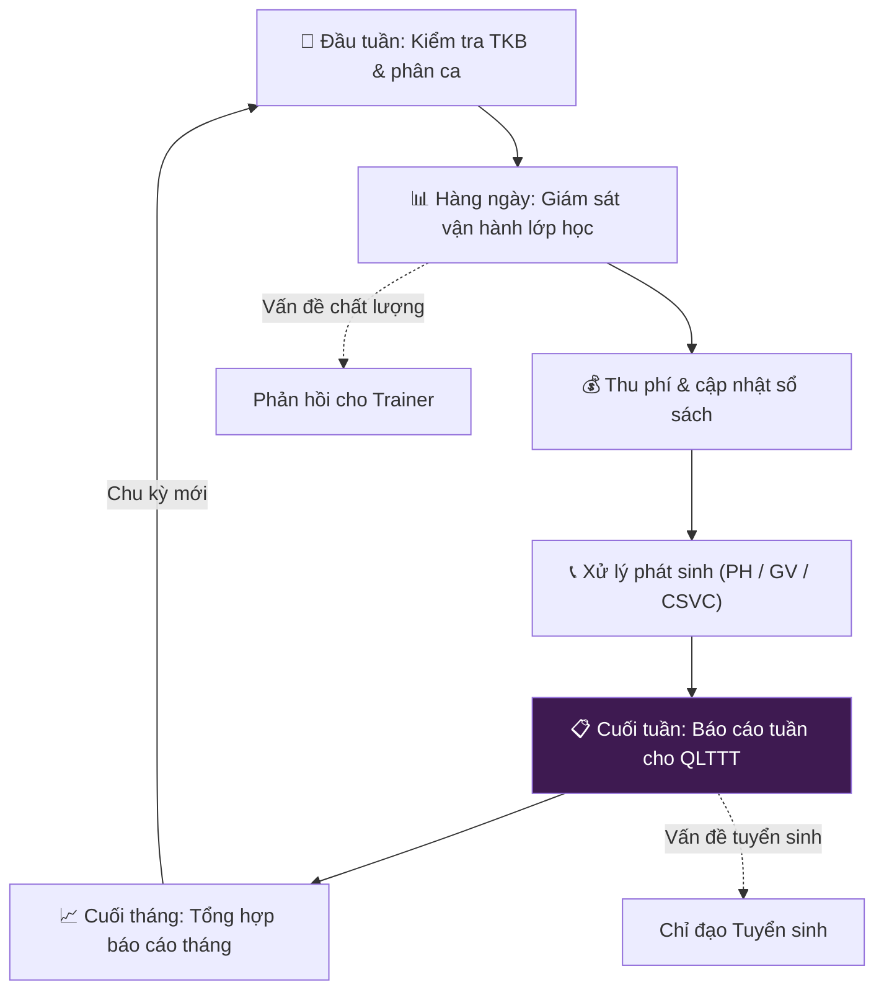

---

### 6. 🎯 QUẢN LÝ TRUNG TÂM (Bao quát toàn bộ)

#### Mục tiêu công việc
- Định hướng chiến lược phát triển toàn hệ thống Luna English
- Đảm bảo tăng trưởng học sinh & doanh thu bền vững
- Duy trì & nâng cao chất lượng đào tạo theo chuẩn thương hiệu

#### Mô tả công việc

| Hạng mục | Chi tiết |
|----------|----------|
| **Chiến lược** | Lập kế hoạch năm, mục tiêu tăng trưởng, mở rộng chương trình |
| **Giám sát** | Theo dõi KPIs toàn cơ sở (tuyển sinh, retention, chất lượng) |
| **Tài chính** | Phê duyệt ngân sách, biểu phí, chi phí marketing |
| **Nhân sự** | Tuyển dụng, phát triển đội ngũ quản lý cơ sở |
| **Lương & Phúc lợi** | Tính lương, gửi email xác nhận lương, trả lương cho toàn bộ nhân sự |
| **Thương hiệu** | Đảm bảo nhận diện thương hiệu đồng nhất theo DNA |
| **Đối ngoại** | Quan hệ với trường TH Tân Mai, đối tác, sự kiện |

#### Quy trình thực hiện

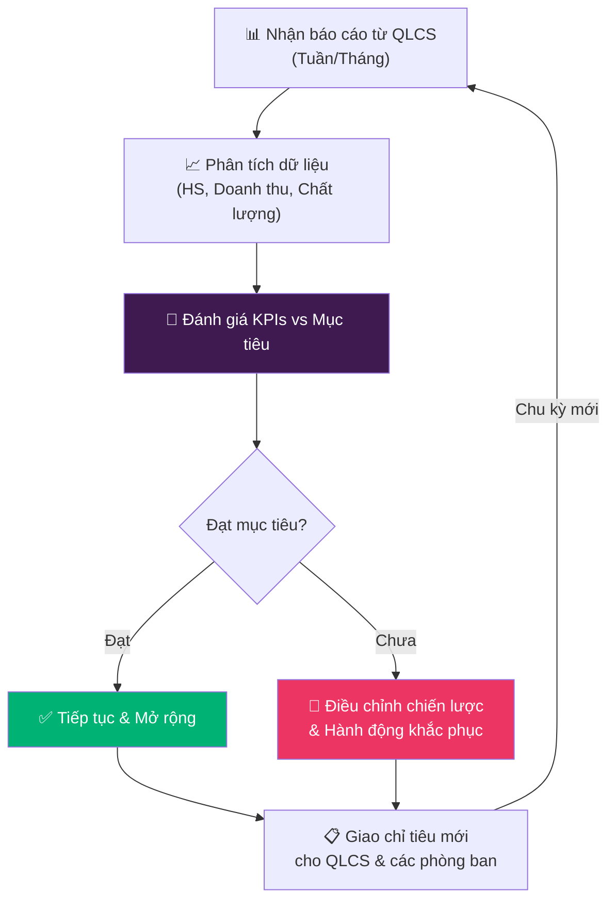

---

### 7. 💰 TÀI CHÍNH

#### Mục tiêu công việc
- Đảm bảo thu học phí đúng hạn, đầy đủ
- Quản lý dòng tiền thu - chi minh bạch, chính xác
- Cung cấp báo cáo tài chính kịp thời cho Quản lý trung tâm

#### Mô tả công việc

| Hạng mục | Chi tiết |
|----------|----------|
| **Thông báo học phí** | Thông báo cho QLCS danh sách học phí cần thu theo từng level/giai đoạn |
| **Thu học phí** | Thu phí từ PH, xuất hóa đơn **ngay trong ngày** thu |
| **Nhắc nhở nợ** | Nhắc nhở QLCS về các HS đóng học phí trễ hạn để phối hợp đốc thu |
| **Ghi chép chi phí** | Ghi nhận đầy đủ mọi khoản chi (lương, thuê mặt bằng, giáo trình, MKT, CSVC...) |
| **Kế toán thuế** | Phối hợp với kế toán thuế bên ngoài: kê khai, nộp thuế đúng hạn |
| **Báo cáo tài chính** | Lập báo cáo thu - chi, lãi lỗ hàng quý và hàng năm cho QLTTT |

#### Quy trình thực hiện

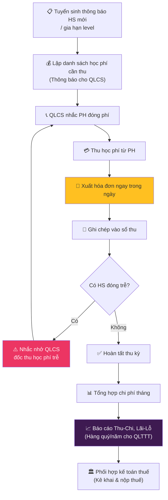

#### Nghiệp vụ Chấm công - Tính lương - Trả lương

> Quy trình trả lương liên kết giữa **QLCS (Admin)** và **Quản lý trung tâm (QLTTT)**. Được thực hiện theo chu kỳ hàng tháng.

##### Phân công trách nhiệm

| Bước | Người thực hiện | Công việc | Thời hạn | Công cụ |
|------|----------------|-----------|----------|--------|
| **1. Chấm công** | QLCS (Admin) | Tổng hợp ngày công, số buổi dạy/trợ giảng, OT, nghỉ phép của từng nhân sự tại cơ sở | Ngày 25-28 hàng tháng | Google Sheets / Excel |
| **2. Gửi bảng chấm công** | QLCS (Admin) | Gửi bảng chấm công tổng hợp cho QLTTT xác nhận | Trước ngày 28 | Email / Google Drive |
| **3. Tính lương** | QLTTT | Tính lương dựa trên bảng chấm công: lương cơ bản + phụ cấp + thưởng - khấu trừ (nghỉ không phép, BHXH...) | Ngày 28-30 | Google Sheets / Excel |
| **4. Gửi phiếu lương** | QLTTT | Gửi email xác nhận lương (payslip) cho **từng nhân sự** để xác nhận trước khi trả | Trước ngày 1 tháng sau | Email cá nhân |
| **5. Xác nhận lương** | Nhân sự | Nhân sự kiểm tra và phản hồi xác nhận hoặc khiếu nại sai sót (nếu có) | Trong 2 ngày làm việc | Email |
| **6. Trả lương** | QLTTT | Chuyển khoản lương cho toàn bộ nhân sự sau khi xác nhận | Ngày 5 tháng sau | Ngân hàng |

##### Flowchart quy trình lương

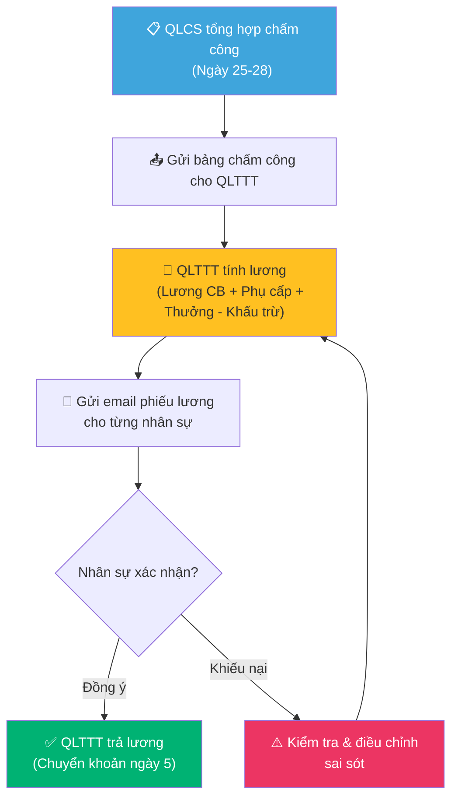

##### Nội dung email phiếu lương (mẫu)

| Mục | Nội dung |
|-----|----------|
| **Tiêu đề** | [Luna English] Phiếu lương tháng MM/YYYY - [Họ tên NV] |
| **Lương cơ bản** | Theo hợp đồng |
| **Số ngày công** | XX ngày (theo bảng chấm công) |
| **Phụ cấp** | Phụ cấp đi lại, ăn trưa, trách nhiệm... |
| **Thưởng** | Thưởng hiệu suất, thưởng tuyển sinh... (nếu có) |
| **Khấu trừ** | Nghỉ không phép, BHXH, thuế TNCN... |
| **Thực nhận** | Tổng thực nhận |
| **Hạn phản hồi** | Trong 2 ngày làm việc kể từ ngày nhận email |

> [!IMPORTANT]
> **Bảo mật:** Phiếu lương được gửi riêng cho từng nhân sự. Nghiêm cấm chia sẻ thông tin lương cho người khác. QLTTT chịu trách nhiệm bảo mật dữ liệu lương.

---

## 🔗 MA TRẬN LIÊN KẾT GIỮA CÁC PHÒNG BAN

| Từ ↓ / Đến → | Marketing | Tuyển sinh | Đào tạo | Vận hành | Tài chính | QL Cơ sở | QL Trung tâm |
|:---|:---:|:---:|:---:|:---:|:---:|:---:|:---:|
| **Marketing** | — | Leads, PH tiềm năng | Nội dung HS giỏi | Video/ảnh lớp học | Chi phí ads | Báo cáo MKT | Báo cáo chiến dịch |
| **Tuyển sinh** | Feedback CPL | — | Yêu cầu test | HS mới xếp lớp | Thông tin thu phí | Báo cáo tuyển sinh | Pipeline |
| **Đào tạo** | — | Chuẩn chương trình | — | Lesson plans, Rubric | — | Báo cáo GV | Báo cáo chất lượng |
| **Vận hành** | Ảnh/Video | — | Phản hồi chất lượng | — | — | Điểm danh, Sự cố | — |
| **Tài chính** | — | — | — | — | — | DS học phí cần thu, nhắc nợ | BC Thu-Chi, Lãi-Lỗ |
| **QL Cơ sở** | Chỉ đạo MKT | Chỉ tiêu | Yêu cầu đào tạo | Giám sát | Thu phí, thanh toán chi | — | Báo cáo tổng hợp |
| **QL Trung tâm** | Chiến lược | KPIs | Chuẩn chất lượng | — | Phê duyệt ngân sách | KPIs & Ngân sách | — |

---

## 📅 CHU KỲ VẬN HÀNH

| Tần suất | Hoạt động | Người thực hiện |
|----------|-----------|-----------------|
| **Hàng ngày** | Giảng dạy, điểm danh, gửi video PH | GV, Trợ giảng |
| **Hàng ngày** | Thu học phí & xuất hóa đơn (nếu có) | Tài chính, QLCS |
| **5 buổi/lần** | Giao bài qua Buttercup Learning / TAK12 + cập nhật Easycheck | GV |
| **Hàng tuần** | Báo cáo MKT, báo cáo vận hành | MKT, QLCS |
| **Hàng tháng** | Workshop GV, báo cáo tổng hợp, tổng hợp chi phí | Trainer, QLCS, Tài chính |
| **Ngày 25-28** | Chấm công tổng hợp, gửi bảng chấm công cho QLTTT | QLCS |
| **Ngày 28-30** | Tính lương, gửi email phiếu lương cho nhân sự | QLTTT |
| **Ngày 5 tháng sau** | Trả lương (chuyển khoản) | QLTTT |
| **Mỗi level** (3 tháng) | Open House, phỏng vấn HS, báo cáo đánh giá | GV, QLCS |
| **Hàng quý** | Review KPIs, điều chỉnh chiến lược, báo cáo Thu-Chi & Lãi-Lỗ | QLTTT, Tài chính |
| **Hàng năm** | Báo cáo tài chính tổng kết, quyết toán thuế | Tài chính, Kế toán thuế |

---

## 📌 KPIs THEO PHÒNG BAN

| Phòng ban | KPIs chính | Mục tiêu gợi ý |
|-----------|------------|-----------------|
| **Marketing** | Số leads/tháng, CPL, Engagement rate | ≥40 leads, CPL ≤100k |
| **Tuyển sinh** | Tỷ lệ chuyển đổi, Retention rate | CR ≥30%, Retention ≥85% |
| **Đào tạo** | Điểm đánh giá GV, % HS đạt chuẩn đầu ra | GV ≥7/10, HS ≥80% |
| **Vận hành (GV)** | Tỷ lệ điểm danh, Hài lòng PH | Attendance ≥90%, CSAT ≥4.5/5 |
| **Vận hành (TA)** | Đánh giá của GV, phản hồi PH về TA, đúng giờ, chất lượng Funtime | GV đánh giá ≥8/10, PH ≥4.5/5 |
| **Tài chính** | Tỷ lệ thu đúng hạn, hóa đơn xuất trong ngày, báo cáo đúng deadline | Thu đúng hạn ≥95%, báo cáo đúng hạn 100% |
| **QL Cơ sở** | Tổng HS, Doanh thu, Giải quyết khiếu nại | Tăng trưởng 15%/năm |
| **QL Trung tâm** | Tăng trưởng hệ thống, ROI | Theo kế hoạch năm |

---

## 💻 HỆ SINH THÁI CÔNG NGHỆ

| Phần mềm | Mục đích | Người sử dụng | Dữ liệu chính |
|-----------|---------|------------------|--------------|
| **Easycheck** | Quản lý lớp học, điểm danh, hồ sơ HS | QLCS, Tuyển sinh, GV | Danh sách HS, điểm danh, tiến độ, nhận xét |
| **Buttercup Learning** | App học tập cho chương trình Buttercup | HS (4-7 tuổi), PH | Bài tập, điểm số, tiến độ học |
| **TAK12** | App học tập cho Tiểu học+ (PS, BGD) | HS (7+ tuổi), PH | Bài tập, bài kiểm tra, điểm số |
| **Google Sheets** | Sổ sách lớp học, dữ liệu gốc | QLCS, Tuyển sinh | Danh sách HS, lịch sử khóa học, liên hệ PH |
| **Facebook / Zalo OA** | Marketing & CSKH | MKT, Tuyển sinh | Leads, tương tác, inbox |

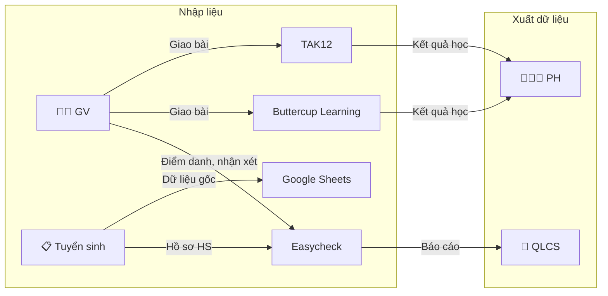

> [!IMPORTANT]
> **Nguyên tắc nhập liệu:** GV cập nhật Easycheck **trong ngày** sau mỗi buổi học. Tuyển sinh cập nhật Google Sheets khi có HS mới/nghỉ. Tránh nhập trùng lặp giữa các hệ thống.

---

## 🎉 LỊCH SỰ KIỆN & MARKETING THEO MÙA

| Tháng | Sự kiện | Hoạt động | Phối hợp |
|-------|---------|-----------|----------|
| **T1-T2** | Tết Nguyên đán | Minigame chúc Tết, ưu đãi đăng ký đầu năm | MKT + Tuyển sinh |
| **T3** | Khai giảng các lớp mới | Open Day, học thử miễn phí | MKT + Tuyển sinh + Vận hành |
| **T5** | Ngày Gia đình VN | Sự kiện Parent-Child, tri ân PH | MKT + Vận hành |
| **T6** | Hè, tuyển sinh mùa hè | Khóa hè đặc biệt, ads tăng cường | MKT + Tuyển sinh |
| **T9** | Khai giảng năm học mới | Open Day, tặng quà khai giảng | MKT + Tuyển sinh |
| **T10** | Halloween | Lớp học Halloween, hoá trang | Vận hành + MKT |
| **T11** | Ngày Nhà giáo VN 20/11 | Tri ân GV, sự kiện HS chúc GV | Vận hành + MKT |
| **T12** | Christmas & Year-end | Tiệc Giáng sinh, tổng kết, ưu đãi đăng ký sớm | Toàn bộ |

---

## 🚀 KẾ HOẠCH TỐI ƯU VẬN HÀNH

### Tối ưu 1: 🎁 Chương trình Referral (Giới thiệu học sinh mới)

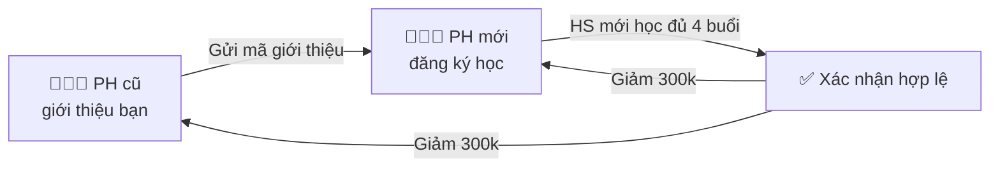

| Hạng mục | Chi tiết |
|----------|----------|
| **Thưởng PH cũ** | Giảm **300.000đ** vào level kế tiếp khi HS mới học đủ 4 buổi |
| **Ưu đãi PH mới** | Giảm **300.000đ** phí level đầu tiên |
| **Gom nhóm 3+** | Giới thiệu cùng lúc ≥3 bạn → mỗi HS mới giảm thêm **200.000đ** |
| **Review thưởng** | PH viết review ≥50 từ + ảnh trên Google Maps → tặng **1 buổi học thêm** |
| **Mã giới thiệu** | Mỗi PH có mã riêng (VD: `LUNA-TENPH`), ghi vào Easycheck để tracking |
| **Thanh toán** | Giảm trực tiếp vào học phí kỳ kế, không quy đổi tiền mặt |

**Kênh truyền thông:**
- In card giới thiệu gửi PH mỗi Open House
- Đăng bài chương trình trên Fanpage + Zalo OA mỗi tháng
- TA nhắc PH cuối mỗi buổi học

**KPI theo dõi:** Số HS mới từ referral/tháng, CPL referral vs ads

---

### Tối ưu 2: 📱 Chuẩn hóa kênh liên lạc

| Mục đích | Kênh chính | Kênh phụ (backup) | Loại bỏ |
|----------|------------|-------------------|---------|
| **Thông báo PH** (lịch, phí, nhận xét) | **Easycheck** (push + in-app) | Zalo OA (broadcast) | ❌ Nhắn Zalo cá nhân rời rạc |
| **Trao đổi PH cá nhân** (vấn đề HS) | **Zalo nhóm lớp** (GV + PH) | Gọi điện (urgent) | ❌ Facebook inbox |
| **Nội bộ hàng ngày** (GV, TA, QLCS) | **1 group Zalo nội bộ** | — | ❌ Nhắn tin cá nhân nhiều kênh |
| **Báo cáo & tài liệu** | **Google Drive** (folder chuẩn) | Email | ❌ Gửi file qua Zalo |
| **Thu phí** | **Chuyển khoản QR** (mã cố định) | Tiền mặt (ghi phiếu thu) | ❌ Nhiều TK cá nhân |

**Cấu trúc Google Drive chuẩn:**
```
Luna English Tân Mai/
├── 📁 01. Quản lý lớp/         (sổ điểm, danh sách HS)
├── 📁 02. Tài chính/            (thu chi, hóa đơn)
├── 📁 03. Marketing/            (content, ảnh, video)
├── 📁 04. Đào tạo/              (lesson plan, rubric, đánh giá GV)
├── 📁 05. Tuyển sinh/           (hồ sơ HS, pipeline)
└── 📁 06. Báo cáo/              (tuần, tháng, quý)
```

> [!WARNING]
> **Nguyên tắc:** Mọi file công việc **PHẢI** lưu trên Google Drive, không lưu trên máy cá nhân. QLCS kiểm tra tuân thủ hàng tuần.

---

### Tối ưu 3: 🎥 Đánh giá GV bằng video thay dự giờ toàn bộ

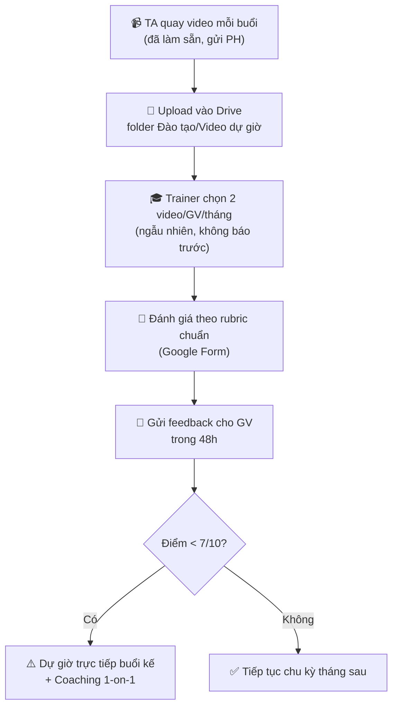

| Hạng mục | Trước (dự giờ truyền thống) | Sau (video + dự giờ kết hợp) |
|----------|---------------------------|------------------------------|
| **Tần suất** | 2 lần dự giờ trực tiếp/GV/tháng | **1 lần review video + 1 lần trực tiếp/quý** |
| **Thời gian Trainer** | ~20h/tháng (di chuyển + dự giờ 5 GV) | ~**6h/tháng** (review video tại nhà) |
| **Tính khách quan** | GV biết trước → có thể "diễn" | Video ngẫu nhiên → **phản ánh thực tế** |
| **Lưu trữ** | Không có bằng chứng | Video lưu Drive → **so sánh tiến bộ theo thời gian** |
| **Cost** | Chi phí di chuyển Trainer | **Giảm ~70% chi phí dự giờ** |

**Rubric đánh giá video (Google Form):**

| Tiêu chí | Điểm (1-10) |
|----------|-------------|
| Mở bài hấp dẫn, warm-up hiệu quả | /10 |
| Hướng dẫn rõ ràng, student talking time ≥60% | /10 |
| Quản lý lớp, xử lý tình huống | /10 |
| Tương tác với HS, khuyến khích tham gia | /10 |
| Kết bài, tổng kết bài học | /10 |
| **Tổng trung bình** | **/10** |

---

> **© Luna English 2025-2026** | Tài liệu nội bộ - Không chia sẻ ra ngoài
